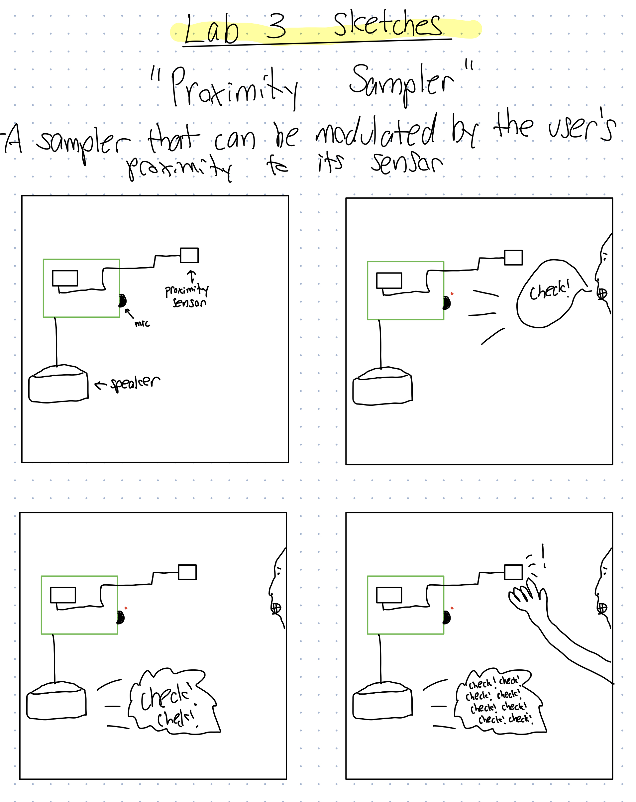

# You're a wizard, Sal


In this lab, we want you to practice wizarding an interactive device as discussed in class. We will focus on audio as the main modality for interaction but there is no reason these general techniques can't extend to video, haptics or other interactive mechanisms. In fact, you are welcome to add those to your project if they enhance your design.


## Text to Speech and Speech to Text

In the home directory of your Pi there is a folder called `text2speech` containing some shell scripts.

```
pi@ixe00:~/text2speech $ ls
Download        festival_demo.sh  GoogleTTS_demo.sh  pico2text_demo.sh
espeak_demo.sh  flite_demo.sh     lookdave.wav

```

you can run these examples by typing 
`./espeak_demo.sh`. Take some time to look at each script and see how it works. You can see a script by typing `cat filename`

```
pi@ixe00:~/text2speech $ cat festival_demo.sh 
#from: https://elinux.org/RPi_Text_to_Speech_(Speech_Synthesis)#Festival_Text_to_Speech

echo "Just what do you think you're doing, Dave?" | festival --tts

```

You can also play audio files directly with `aplay filename`.

After looking through this folder do the same for the `speech2text` folder. In particular, look at `test_words.py` and make sure you understand how the vocab is defined. Then try `./vosk_demo_mic.sh`

Video of working demos can be found here: https://youtu.be/ODtvudZVtHw

## Serving Pages

In Lab 1 we served a webpage with flask. In this lab you may find it useful to serve a webpage for the controller on a remote device. Here is a simple example of a webserver.

```
pi@ixe00:~/$ python server.py
 * Serving Flask app "server" (lazy loading)
 * Environment: production
   WARNING: This is a development server. Do not use it in a production deployment.
   Use a production WSGI server instead.
 * Debug mode: on
 * Running on http://0.0.0.0:5000/ (Press CTRL+C to quit)
 * Restarting with stat
 * Debugger is active!
 * Debugger PIN: 162-573-883
```
From a remote browser on the same network, check to make sure your webserver is working by going to [http://ixe00.local:5000]()


## Demo

In the [demo directory](./demo), you will find an example wizard of oz project you may use as a template. **You do not have to** feel free to get creative. In that project, you can see how audio and sensor data is streamed from the Pi to a wizard controller that runs in the browser. You can control what system says from the controller as well.

## Optional

There is an included [dspeech](.dspeech) demo that uses [Mozilla DeepSpeech](https://github.com/mozilla/DeepSpeech) for speech to text. If you're interested in trying it out we suggest you create a seperarate virutalenv. 


# Lab 3 Part 2

Create a system that runs on the Raspberry Pi that takes in one or more sensors and requires participants to speak to it. Document how the system works and include videos of both the system and the controller.

## Prep for Part 2

1. Sketch ideas for what you'll work on in lab on Wednesday.



## Share your idea sketches with Zoom Room mates and get feedback

*what was the feedback? Who did it come from?*

In my Zoom Room, Shivani liked the idea of creating a musical instrument using the one's own voice. She suggested having a baseline bpm for the sample's playback so that it is easier for the user to understand what the purpose of this instrument is. Sam made the awesome suggestion of potentially adding the accelerometer to module the pitch of the sample once I got the proximity feature working. This added feature could add some musical depth and add to the enjoyment of this interactive device.

## Prototype your system

The system should:
* use the Raspberry Pi 
* use one or more sensors
* require participants to speak to it. 

*Document how the system works*

In an age where music performance and production is increasingly digitized, I sought to make a device that leverages technology to bring the physical element back to the creative process of musicmaking. This device is a simple prototype of what I would call a "proximity" sampler. Essentially, this device captures any spoken audio that the user provides via the microphone and plays it back to the user through the connected speaker. The kicker here is that the Pi's onboard sensors will modulate the soudwave that is played back based on the input data. Concretely, this would mean that the user could play their own sample back like a musical instrument by holding their hand closer or farther away from the proximity sensor. This allows additional depth in the creative sampling process by giving the user the ability to add rhythmic or percussive aspects to their desired spoken-word sample.

One wrinkle I ran into with this implementation was that my Eavesdrop feature of the demo file was not working. This was in spite of following all of the directions and ensuring that I was accessing the correct port for the usb microphone. In fact, I was able to demonstrate that my microphone was not the issue in my bonus Pyaudio clip. I tried asking the IDD Slack channel if anyone was able to get Eavesdrop to work for their demo file, but did not receive any responses. As a result, I had to proceed with a demo focused on text-input from the user for the samples. 

*Include videos or screencaptures of both the system and the controller.*

## Test the system
Try to get at least two people to interact with your system. (Ideally, you would inform them that there is a wizard _after_ the interaction, but we recognize that can be hard.)
I was able to get Brandt Beckerman and Ahaan Parekh to interact with my system. I have summarized their feedback in the responses below.

Answer the following:

### What worked well about the system and what didn't?
*your answer here*

### What worked well about the controller and what didn't?

*your answer here*

### What lessons can you take away from the WoZ interactions for designing a more autonomous version of the system?

*your answer here*


### How could you use your system to create a dataset of interaction? What other sensing modalities would make sense to capture?

*your answer here*

