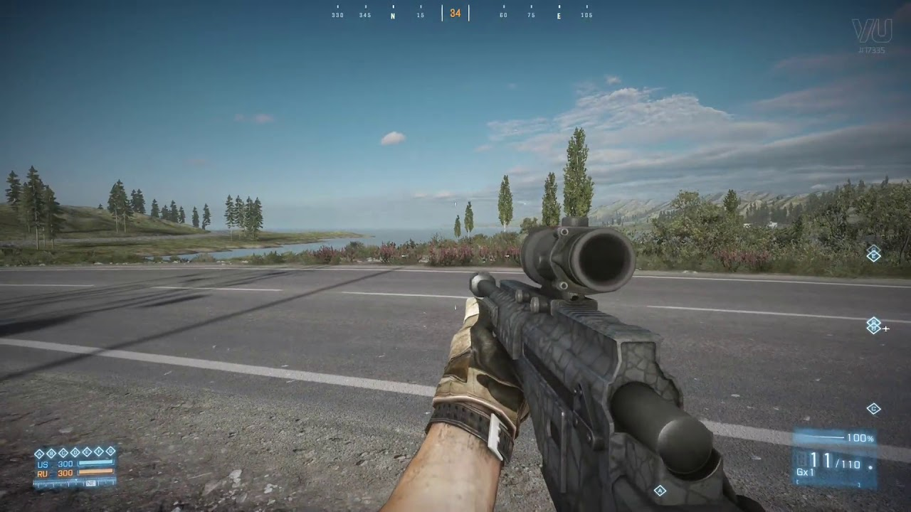

# Ph-UI!!!

For lab this week, we focus on the prototyping the physical look and feel of the device. _Make sure you read all the instructions and understand the whole of the laboratory activity before starting!_


## Prep

1. Pull the new Github Repo.
2. Readings: 

* [What do prototypes prototype?](https://www.semanticscholar.org/paper/What-do-Prototypes-Prototype-Houde-Hill/30bc6125fab9d9b2d5854223aeea7900a218f149)

* [Paper prototyping](https://www.uxpin.com/studio/blog/paper-prototyping-the-practical-beginners-guide/) is used by UX designers to quickly develop interface ideas and run them by people before any programming occurs. 

* [Cardboard prototypes](https://www.youtube.com/watch?v=k_9Q-KDSb9o) help interactive product designers to work through additional issues, like how big something should be, how it could be carried, where it would sit. 

* [Tips to Cut, Fold, Mold and Papier-Mache Cardboard](https://makezine.com/2016/04/21/working-with-cardboard-tips-cut-fold-mold-papier-mache/) from Make Magazine.

* [Surprisingly complicated forms](https://www.pinterest.com/pin/50032245843343100/) can be built with paper, cardstock or cardboard.  The most advanced and challenging prototypes to prototype with paper are [cardboard mechanisms](https://www.pinterest.com/helgangchin/paper-mechanisms/) which move and change. 

 Dyson Vacuum cardboard prototypes


### For lab, you will need:

1. Cardboard (start collecting those shipping boxes!)
1. Cutting board
1. Cutting tools
1. Markers
1. Found objects and materials--like bananas--we're not saying that to be funny.


### Deliverables for this lab are: 
1. Sketches/photos of device designs
1. "Looks like" prototypes: show us what how the device should look, feel, sit, weigh, etc.
3. "Works like" prototypes: show us what the device can do
4. "Acts like" prototypes: videos/storyboards/other means of showing how a person would interact with the device
5. Submit these in the lab 4 folder of your class [Github page], either as links or uploaded files. Each group member should post their own copy of the work to their own Lab Hub, even if some of the work is the same for each person in the group.


## Overview
Here are the parts of the assignment

A) [Capacitive Sensing](#part-a)

B) [OLED screen](#part-b) 

C) [Paper Display](#part-c)

D) [Wizard the device](#part-d-wizard-the-device) 

E) [Costume the device](#part-e-costume-the-device)

F) [Record the interaction](#part-f-record)

## The Report
This readme.md page in your own repository should be edited to include the work you have done. You can delete everything but the headers and the sections between the **stars**. Write the answers to the questions under the starred sentences. 

Include any material that explains what you did in this lab hub folder, and link it in the readme.

Labs are due on Mondays. Make sure this page is linked to on your main class hub page.

### Part A
### Capacitive Sensing, a.k.a. Human Banana Interaction

We wanted to introduce you to the [capacitive sensor](https://learn.adafruit.com/adafruit-mpr121-gator) in your kit. It's one of the most flexible input devices we were able to provide. At boot it measures the capacitance on each of the 12 contacts. Whenever that capacitance changes it considers it a user touch. You can attach any conductive material. In your kit you have conductive fabric and copper tape that will work well, but don't limit yourself! In this lab we will use (go?) bananas!

<p float="left">


</p>

Plug in the capacitive sensor board with the qwiic connector. Connect your banana's with either the copper tape or the alligator clips (the clips work better). make sure to install the requirements from `requirements.txt`


I've connected my banana's* to pads 6 and 10. When you run the code and touch a banana the terminal will print out the following

```
(circuitpython) pi@ixe00:~/Interactive-Lab-Hub/Lab 4 $ python cap_test.py 
Banana 10 touched!
Banana 6 touched!
```

*\*Some students have noted that their banana's look noticeably different from the ones presented in this demo. We firmly reject the accusation that these are not in fact banana's but Twizzlers™. Due to the challenges of remote teaching we cannot debug banana's at this time. We suggest you bring these issues up with the university or your local produce representative*

### Part B
### OLED screen

We just received some of the small oled screens that we had coped to include in your kit. If you want one feel free to pop into the lab and get one. These don't have colors like the one on the pi but you can move it around on a cable making for more flexible interface design. The way you program this display is almost identical to the pi display. Take a look at `oled_test.py` and some more of the [Adafruit examples](https://github.com/adafruit/Adafruit_CircuitPython_SSD1306/tree/master/examples).

<p float="left">


</p>


### Part C
### Paper Display

Here is an Pi with a paper faceplate on it to turn it into a display:


This is fine, but it can be a bit difficult to lay out a great and user friendly display within the constraints of the Pi. Also, it really only works for applications where people can come and stand over the Pi, or where you can mount the Pi to the wall.

Here is another prototype for a paper display:


It holds a pi and usb power supply, and provides a front stage on which to put writing, graphics, LEDs, buttons or displays.

This design can be made by scoring a long strip of corrugated cardboard of width X, with the following measurements:

| Y height of box <br> <sub><sup>- thickness of cardboard</sup></sub> | Z  depth of box <br><sub><sup>- thickness of cardboard</sup></sub> | Y height of box  | Z  depth of box | H height of faceplate <br><sub><sup>* * * * * (don't make this too short) * * * * *</sup></sub>|
| --- | --- | --- | --- | --- | 

Fold the first flap of the strip so that it sits flush against the back of the face plate, and tape, velcro or hot glue it in place. This will make a H x X interface, with a box of Z x X footprint (which you can adapt to the things you want to put in the box) and a height Y in the back. 

Here is an example:


Make a paper display for your project that communicates the state of the Pi and a sensor. Ideally you should design it so that you can slide the Pi out to work on the circuit or programming, and then slide it back in and reattach a few wires to be back in operation.

### Overview of My Project

Inspired by the interfaces of popular battle-royale videogames (see screenshots below), I wanted to create a device that brings this interaction to a real-world application. Similar to battle-royale type games, paintball is a sport that relies heavily on teamwork and communication to spot and eliminate enemies. One challenge in the real world is articulating to teammates where an enemy is during the heat-of-battle. My goal with this device is to create a heads-up display that emulates the compass functionality found on popular battle royale games for the paintball field.




Beginning of video also gives a brief overview of the "why" behind the project
**https://youtu.be/ufDbFqaocHI?t=0 (00:00)**
 
**a. Document the design for your paper display.** (e.g. if you had to make it again from scratch, what information would you need?). Include interim iterations (or at least tell us about them).

Since this is a wearable heads-up display, there are actually 2 displays I am working with. The first is wrist-mounted and handles user interactions for starting/stopping the device and turning it on. The raspberry pi is enclosed in a cardboard box wrapped in black ducktape and mounted on a tactical wriststrap for this purpose.

Using a long cable, I then connect this wrist-mounted Pi to a smaller display that exists in the user's sight-of-line. This display indicates to the user the state of the Pi regarding what direction they are looking as measured in degrees.

[picture of paper display from multiple angles]


**b. Make a video of your paper display in action.**
**https://youtu.be/ufDbFqaocHI?t=55 (00:54)**

**c. Explain the rationale for the design.** (e.g. Does it need to be a certain size or form or need to be able to be seen from a certain distance?)

Since this device is to be used on a paintball field, the device ideally needs to be operable hands-free. It also needs to blend in with the player's outfit which tends to be tactical and black. Finally, the design of this device cannot interefere with the player's ability to see enemies on the field. As a result, I made sure the oled display was mounted high-up in the user's line-of-sight.

One challenge I had was striking the right balance between readability of the screen and size of the prototype. Initially, I had the screen much closer to the player's face, but this made it nearly impossible for the player to comfortably look up and read the device. I ended up having to move the oled screen pretty far out forward in order to make it readable. If I were to design a production version of this device, I would definitely need to consider the readability of the screen at an extremely close distance. A projector-style HUD might be able to accomplish this design objective.

### Part D
### Materiality

**Open Ended**: We are putting very few constraints on this part but we want you to get creative.

Design a system with the Pi and anything from your kit with a focus on form, and materiality. The "stuff" that enclose the system should be informed by the desired interaction. What would a computer made of rocks be like? How would an ipod made of grass behave? Would a roomba made of gold clean your floor any differently?

I discuss these aspects in the section of my video linked below
**https://youtu.be/ufDbFqaocHI?t=55 (00:54)**

**a. document the material prototype.** Include candidates that were considered even if they were set aside later.

I used the following materials to build this system: flat-brimmed baseball cap, cardboard, black ducktape, tactical wriststrap, raspberry pi, accelermeter, oled screen, hot glue, extra-long connector cable.

As alluded to in the video, this device is designed with the intention of being deployed on a paintball field during a game. I used materials that are already utilized in paintball gear with the goal of blending in with the rest of a player's setup and, ideally, being able to handle water. 

**b. explain the selection.**

In designing this system, I had to strike a balance between ease-of-prototyping and practicality. I settled on cardboard for the vast majority of the system's enclosures since it is easy to manipulate into the shapes I need for it to be a wearable. If I were designing a production version of this device, I would need to focus on materials that would be able to withstand getting hit by a 280 meters/second gel paintball capsule. Impact-resistant plastic tends to be the material of choice in this type of application. 


### Part 2.

Following exploration and reflection from Part 1, complete the "looks like," "works like" and "acts like" prototypes for your design.

Reiterating:
### Deliverables for this lab are: 
1. Sketches/photos of device designs: 360-degree look of the system on a person **https://youtu.be/ufDbFqaocHI?t=207**


3. "Looks like" prototypes: show us what how the device should look, feel, sit, weigh, etc. **https://youtu.be/ufDbFqaocHI?t=16 (00:16)**
4. "Works like" prototypes: show us what the device can do **https://youtu.be/ufDbFqaocHI?t=135 (02:15)**
5. "Acts like" prototypes: videos/storyboards/other means of showing how a person would interact with the device **https://youtu.be/ufDbFqaocHI?t=215 (03:35)**
6. Submit these in the lab 4 folder of your class [Github page], either as links or uploaded files. Each group member should post their own copy of the work to their own Lab Hub, even if some of the work is the same for each person in the group.


