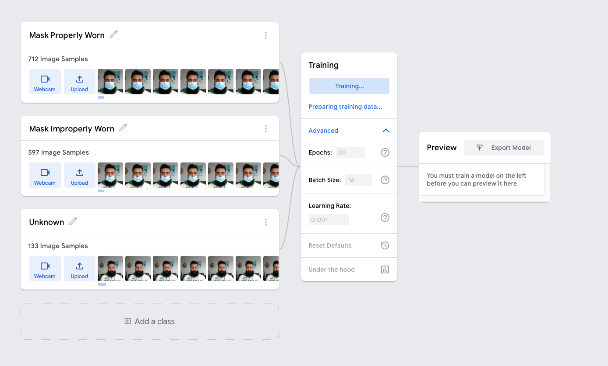
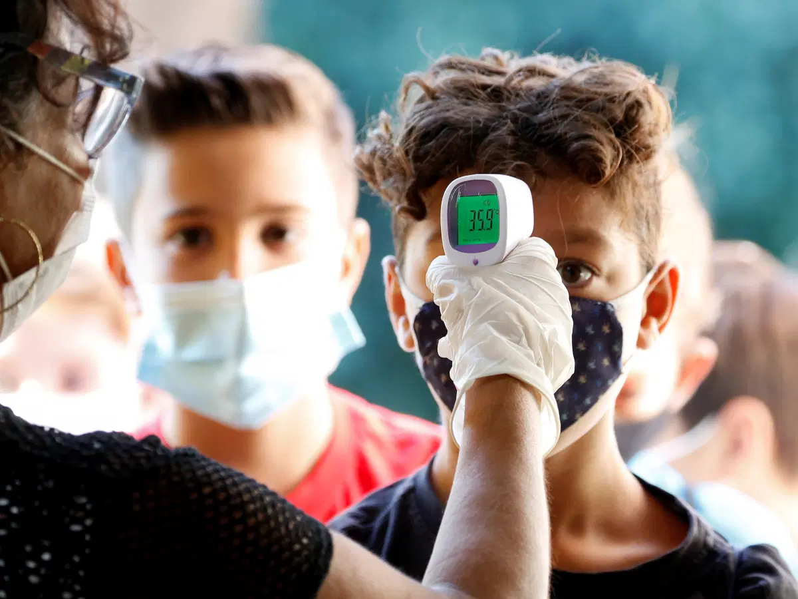
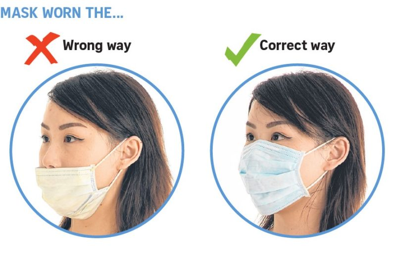
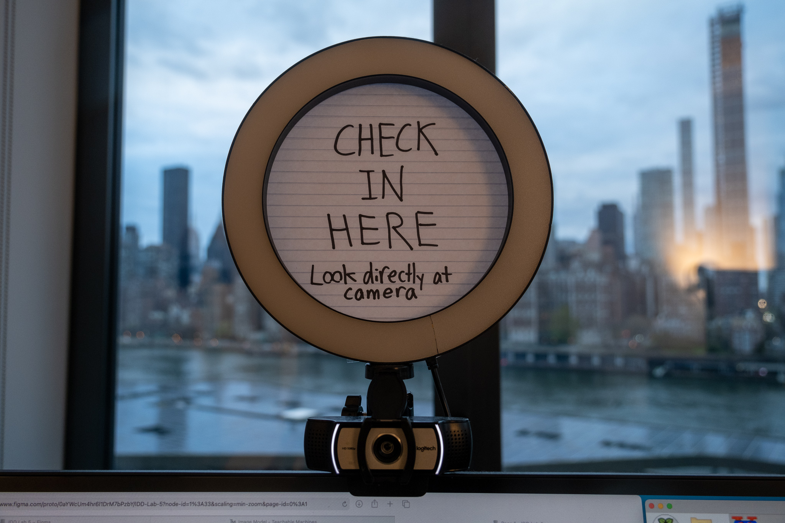
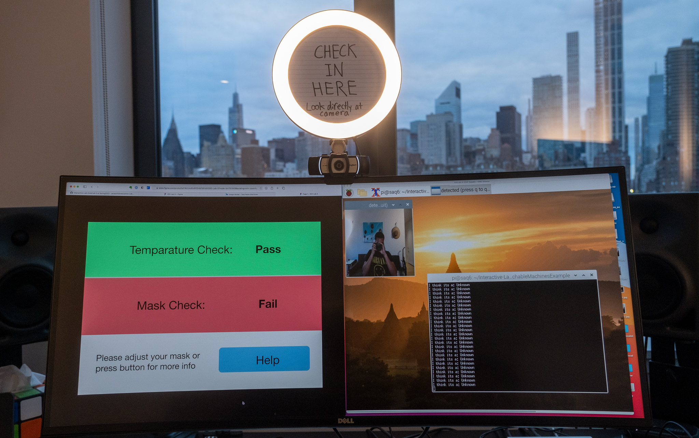
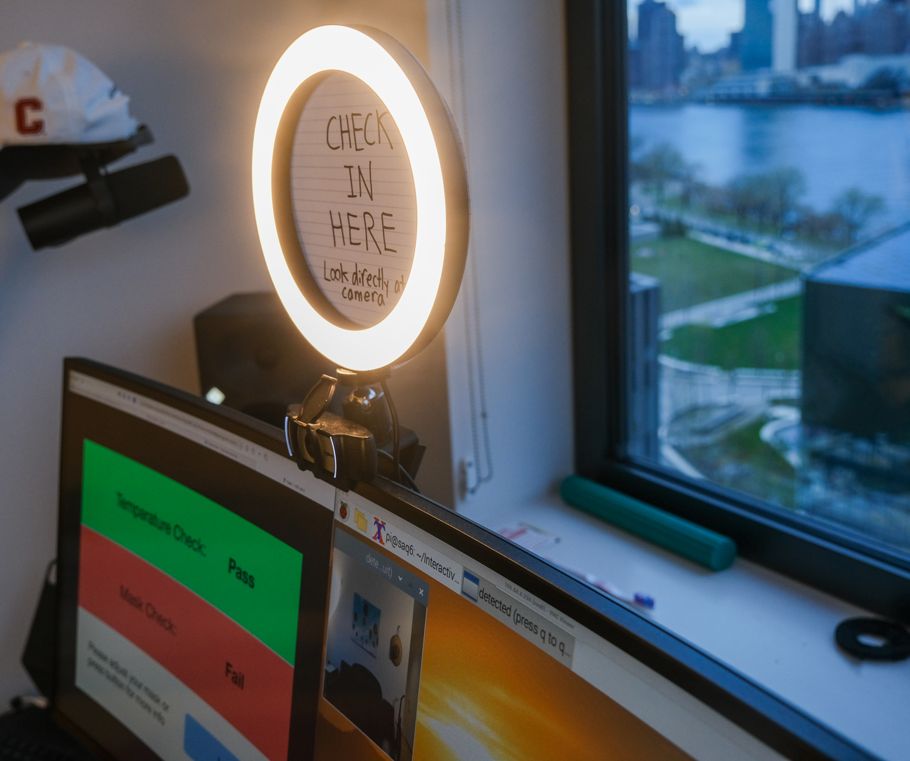
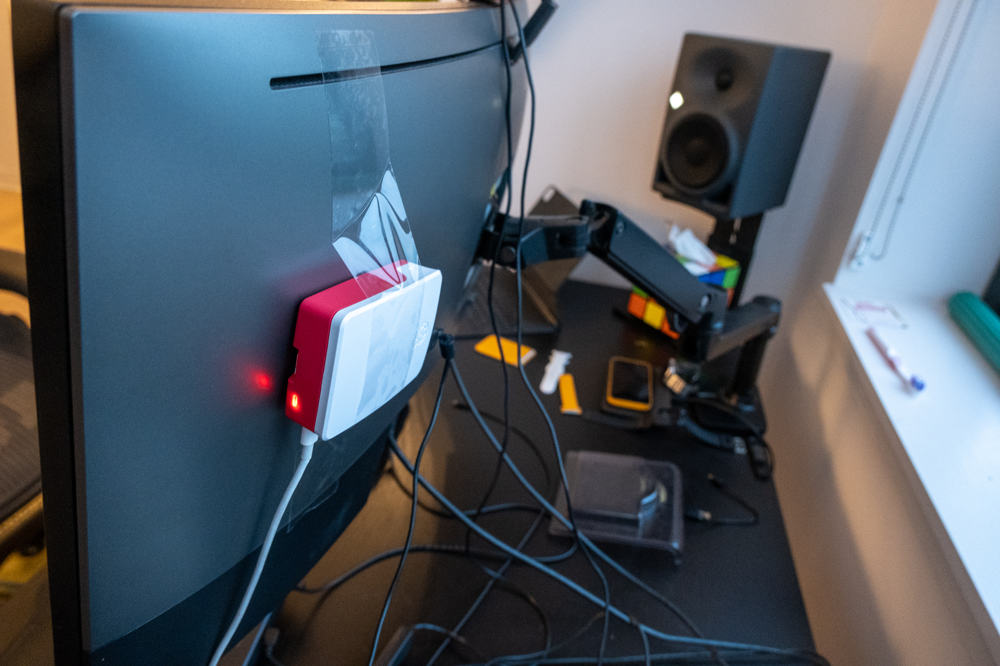

# Observant Systems


For lab this week, we focus on creating interactive systems that can detect and respond to events or stimuli in the environment of the Pi, like the Boat Detector we mentioned in lecture. 
Your **observant device** could, for example, count items, find objects, recognize an event or continuously monitor a room.

This lab will help you think through the design of observant systems, particularly corner cases that the algorithms need to be aware of.

In Lab 5 part 1, we focus on detecting and sense-making.

In Lab 5 part 2, we'll incorporate interactive responses.


## Prep

1.  Pull the new Github Repo.
2.  Read about [OpenCV](https://opencv.org/about/).
3.  Read Belloti, et al's [Making Sense of Sensing Systems: Five Questions for Designers and Researchers](https://www.cc.gatech.edu/~keith/pubs/chi2002-sensing.pdf)

### For the lab, you will need:

1. Raspberry Pi
1. Raspberry Pi Camera (2.1)
1. Microphone (if you want speech or sound input)
1. Webcam (if you want to be able to locate the camera more flexibly than the Pi Camera)

### Deliverables for this lab are:
1. Show pictures, videos of the "sense-making" algorithms you tried.
1. Show a video of how you embed one of these algorithms into your observant system.
1. Test, characterize your interactive device. Show faults in the detection and how the system handled it.


## Overview
Building upon the paper-airplane metaphor (we're understanding the material of machine learning for design), here are the four sections of the lab activity:

A) [Play](#part-a)

B) [Fold](#part-b)

C) [Flight test](#part-c)

D) [Reflect](#part-d)

---

### Part A
### Play with different sense-making algorithms.

Befor you get started connect the RaspberryPi Camera V2. [The Pi hut has a great explanation on how to do that](https://thepihut.com/blogs/raspberry-pi-tutorials/16021420-how-to-install-use-the-raspberry-pi-camera).  

#### OpenCV
A more traditional to extract information out of images is provided with OpenCV. The RPI image provided to you comes with an optimized installation that can be accessed through python.

Additionally, we also included 4 standard OpenCV examples. These examples include contour(blob) detection, face detection with the ``Haarcascade``, flow detection(a type of keypoint tracking), and standard object detection with the [Yolo](https://pjreddie.com/darknet/yolo/) darknet.

Most examples can be run with a screen (I.e. VNC or ssh -X or with an HDMI monitor), or with just the terminal. The examples are separated out into different folders. Each folder contains a ```HowToUse.md``` file, which explains how to run the python example.

```shell
pi@ixe00:~/openCV-examples $ tree -l
.
├── contours-detection
│   ├── contours.py
│   └── HowToUse.md
├── data
│   ├── slow_traffic_small.mp4
│   └── test.jpg
├── face-detection
│   ├── face-detection.py
│   ├── faces_detected.jpg
│   ├── haarcascade_eye_tree_eyeglasses.xml
│   ├── haarcascade_eye.xml
│   ├── haarcascade_frontalface_alt.xml
│   ├── haarcascade_frontalface_default.xml
│   └── HowToUse.md
├── flow-detection
│   ├── flow.png
│   ├── HowToUse.md
│   └── optical_flow.py
└── object-detection
    ├── detected_out.jpg
    ├── detect.py
    ├── frozen_inference_graph.pb
    ├── HowToUse.md
    └── ssd_mobilenet_v2_coco_2018_03_29.pbtxt
```
#### Filtering, FFTs, and Time Series data.
Additional filtering and analysis can be done on the sensors that were provided in the kit. For example, running a Fast Fourier Transform over the IMU data stream could create a simple activity classifier between walking, running, and standing.

Using the set up from the [Lab 3 demo](https://github.com/FAR-Lab/Interactive-Lab-Hub/tree/Spring2021/Lab%203/demo) and the accelerometer, try the following:

**1. Set up threshold detection** Can you identify when a signal goes above certain fixed values?

**2. Set up averaging** Can you average your signal in N-sample blocks? N-sample running average?

**3. Set up peak detection** Can you identify when your signal reaches a peak and then goes down?

Include links to your code here, and put the code for these in your repo--they will come in handy later.

#### Teachable Machines (beta, optional)
Google's [TeachableMachines](https://teachablemachine.withgoogle.com/train) might look very simple.  However, its simplicity is very useful for experimenting with the capabilities of this technology.

You can train a Model on your browser, experiment with its performance, and then port it to the Raspberry Pi to do even its task on the device.

Here is Adafruit's directions on using Raspberry Pi and the Pi camera with Teachable Machines:

1. [Setup](https://learn.adafruit.com/teachable-machine-raspberry-pi-tensorflow-camera/raspberry-pi-setup)
2. Install Tensorflow: Like [this](https://learn.adafruit.com/running-tensorflow-lite-on-the-raspberry-pi-4/tensorflow-lite-2-setup), but use this [pre-built binary](https://github.com/bitsy-ai/tensorflow-arm-bin/) [the file](https://github.com/bitsy-ai/tensorflow-arm-bin/releases/download/v2.4.0/tensorflow-2.4.0-cp37-none-linux_armv7l.whl) for Tensorflow, it will speed things up a lot.
3. [Collect data and train models using the PiCam](https://learn.adafruit.com/teachable-machine-raspberry-pi-tensorflow-camera/training)
4. [Export and run trained models on the Pi](https://learn.adafruit.com/teachable-machine-raspberry-pi-tensorflow-camera/transferring-to-the-pi)

Alternative less steps option is [here](https://github.com/FAR-Lab/TensorflowonThePi).

I ended up using a model trained by Teachable Machines for this lab. I used the shortened instructions provided by David to install Tensorflow onto the Pi. The goal of my model is to classify whether or not a user is correctly wearing his/her mask. There are three classes I trained: 1) Mask properly worn 2) Mask not properly worn 3) Unknown (Mask not detected at all). I trained these three classes using a variety of masks and head positions through the Teachable Machines interface. In all, I used over 1,500 images to train my model, and this was sufficient to produce pretty good results when testing the model.



#### PyTorch  
As a note, the global Python install contains also a PyTorch installation. That can be experimented with as well if you are so inclined.

### Part B
### Construct a simple interaction.

Pick one of the models you have tried, pick a class of objects, and experiment with prototyping an interaction.
This can be as simple as the boat detector earlier.
Try out different interactions outputs and inputs.
**Describe and detail the interaction, as well as your experimentation.**


In the age of COVID-19, businesses are tasked with "checking in" patrons by taking their temperature and ensuring they are wearing a mask. As the economy continues to open up , businesses will face a large influx of customers who they need to vet against public health guidelines.

I designed a simple system that aims to automate the check-in process for patrons by automatically checking 1) temperature and 2) mask is worn properly. For the purposes of this lab, I am assuming the temperature check works correctly and will be focusing my machine learning model on gauging whether or not the user is wearing a mask in accordance with public safety guidelines. Concretly, I want the model to ensure that customers who expose their noses over their mask are flagged and denied entry until they adjust their mask.





### Part C
### Test the interaction prototype

Now flight test your interactive prototype and **note your observations**:
For example:
1. When does it what it is supposed to do?
The system does what it is supposed to do under what I would describe as ideal circumstances. In other words, when the user is directly in front of the camera under good lighting, the system is able to accurately determine if they are wearing their mask properly. Because the system requires good lighting, I attached a ringlight to my camera using double-sided tape. This ensures that I can maximize the likelihood of the system picking up a good reading from the camera data.

2. When does it fail?
The system fails when it encounters a situation that falls outside of the bounds of the training data. For example, if the lighting is not good, the system may not be able to detect a mask at all even if the user is wearing one. Similarly, if the user is wearing a mask that looks substantially different than the 4 masks I trained the model with, it may not accurately classify what is happening.

3. When it fails, why does it fail?
The reason the system fails when it does comes down to the robustness of the machine learning model. I only trained the model with a relatively small set of data encompassing 4 masks and a variety of head positions. I did not train with a wide variety of users, backgrounds, or lighting conditions. If one of these other parameters veers too far off of the training data coverage, the model will most likely fail.

4. Based on the behavior you have seen, what other scenarios could cause problems?
As alluded to earlier, situations where the system has to deal with 1.) poor lighting 2.) a wide variety of masks 3.) a wide variety of different users with different facial structures could all be scenarios that could cause problems.

**Think about someone using the system. Describe how you think this will work.**
1. Are they aware of the uncertainties in the system?
A typical user will most likely not be aware of uncertainties in the system. Most users expect a user-facing device to be robust enough to deploy into production. They are not necessarily going to know why the underlying model might be misreading their face and denying them entry to the venue. This is important to keep mind of and is the reason why I included a section on the user interface where they can call for help and have a person intervene via video-conference.

2. How bad would they be impacted by a miss classification?
A misclassificaiton would mean that the user would be denied to the business they are patronizing. Not only would this be anxiety-inducing, but it could also mean lost revenue for the business and time wasted for the end-user.

3. How could change your interactive system to address this?
I could add a human layer to this similar to how automatic parking gate work. In the event that a user cannot enter, they can his a button to call an attendant who may be able to help their situation or correct mistakes that the camera is making by viewing the video feed directly.

In addition, I could design the system so that it can handle a wider variety of cases while limited background noise. This can be accomplished with better use of lighting, cleaner backgrounds, use of higher-end cameras, and a wider variety of training data.

5. Are there optimizations you can try to do on your sense-making algorithm.
I can train the algorithm with more training data and I can train the algorithm with more epochs. Both of these optimizations will likely yield a better performing algorithm in the real-world.

### Part D
### Characterize your own Observant system









Now that you have experimented with one or more of these sense-making systems **characterize their behavior**.
During the lecture, we mentioned questions to help characterize a material:
* What can you use X for?
* What is a good environment for X?
* What is a bad environment for X?
* When will X break?
* When it breaks how will X break?
* What are other properties/behaviors of X?
* How does X feel?

I answer all of these questions in the video below.

**Include a short video demonstrating the answers to these questions.**
https://youtu.be/VkWieoXWfHE

### Part 2.

Following exploration and reflection from Part 1, finish building your interactive system, and demonstrate it in use with a video.

I demo the full system in the video below.

**Include a short video demonstrating the finished result.**
https://youtu.be/L5C-hokc_RM

